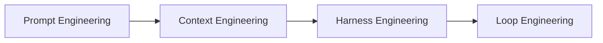
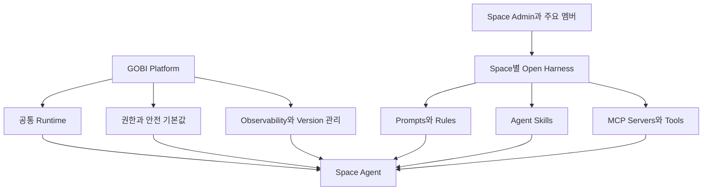

## 한 줄 요약

GOBI가 모든 Space Agent의 Guardrail을 내부에서 직접 만들기보다, 각 Space의 admin과 주요 멤버가 Agent의 prompt와 운영 규칙을 함께 만들고 수정할 수 있는 **Open Harness** 구조를 제공하면 좋겠다. 처음에는 prompt 관리부터 시작하고, 이후 Agent Skills와 MCP server까지 연결할 수 있게 확장하면 각 커뮤니티가 자신에게 맞는 AI Agent를 직접 키울 수 있다.

## 아이디어가 나온 배경

2026년 6월 17일 김성진님과 온라인으로 Loop Engineering에 관해 이야기하다가, AI Agent 기술의 변화가 다음과 같은 흐름으로 발전하고 있다는 이야기를 나눴다. Prompt Engineering에서 시작해 Context Engineering과 Harness Engineering으로 확장됐고, 이제는 Agent가 목표를 향해 반복적으로 판단하고 행동하는 Loop Engineering까지 이어지고 있다는 관점이다.

이 대화를 나누면서 평소 GOBI Desktop과 GOBI Space의 Harness Engineering에 대해 생각했던 내용이 다시 떠올랐다. GOBI가 Space마다 AI Agent를 제공하려면 Agent의 역할, 권한, 행동 기준, 사용할 도구, 안전 기준을 누군가 지속해서 설계하고 관리해야 한다.

## Harness Engineering에 대한 정의

여기서 Harness Engineering은 AI Agent Application이 정해진 역할과 범위 안에서 일하도록 실행 환경과 Guardrail을 만드는 작업을 뜻한다. 단순히 system prompt 하나를 잘 작성하는 것이 아니라, Agent가 어떤 정보를 보고 어떤 도구를 사용하며 어디까지 행동할 수 있는지를 전체적으로 설계하는 일이다.

> "Harness Engineering은 프롬프트, MCP, Skill 등을 활용해서 AI Agent Application의 Guardrail을 만드는 일이라고 생각합니다."
> - Changsoo

이 관점에서 Harness의 구성요소는 다음과 같이 정리할 수 있다.

> **Harness = Prompt + MCP + Agent Skills + Evaluation Harness + Memory + Permissions + Safety Guardrails + Observability + Orchestration**

| 구성요소 | 역할 |
| --- | --- |
| Prompt | Agent의 역할, 목표, 말투, 판단 기준, 금지 사항 정의 |
| MCP | Agent가 외부 데이터와 기능에 접근하는 표준 연결 지점 |
| Agent Skills | 반복되는 전문 작업과 workflow를 재사용 가능한 능력으로 제공 |
| Evaluation Harness | Agent의 답변과 행동이 기대한 기준을 충족하는지 평가 |
| Memory | Space의 기록, 대화, 결정, 멤버 context 유지 |
| Permissions | Agent와 사용자별로 접근 가능한 데이터와 행동 범위 제한 |
| Safety Guardrails | 위험하거나 부적절한 행동을 막는 기준과 절차 제공 |
| Observability | Agent가 무엇을 보고 어떻게 판단하고 행동했는지 확인 |
| Orchestration | 여러 Agent, Skill, Tool, workflow의 실행 순서와 협업 관리 |

## GOBI가 마주할 수 있는 현실적인 문제

완성도 높은 Harness를 만드는 일에는 많은 인력과 시간이 필요하다. Prompt를 만드는 것만으로 끝나지 않고, Tool 연결, 권한, 평가, 안전, memory, logging, 운영 개선까지 계속 관리해야 하기 때문이다.

Anthropic, OpenAI와 같은 거대 AI 회사나 많은 인력을 가진 기업은 이 분야를 전담하는 팀을 운영할 수 있다. GOBI가 같은 방식으로 모든 Space와 use case에 필요한 Harness를 직접 만들어 경쟁하는 것은 현실적으로 부담이 큰 접근이라고 생각한다.

그러나 GOBI가 모든 Harness를 직접 만드는 대신, 플랫폼과 커뮤니티가 역할을 나누는 구조를 제공한다면 다른 가능성이 생긴다. Microsoft나 Apple 같은 closed system보다 Linux와 open source community에 가까운 접근을 적용하는 것이다.

## 제안: Space별 Open Harness

핵심 제안은 각 GOBI Space가 자신의 Space Agent를 직접 관리할 수 있게 하는 것이다. GOBI는 Agent와 Harness를 실행할 수 있는 platform을 제공하고, 각 Space의 admin과 주요 멤버는 자신들의 목적과 문화에 맞는 prompt와 운영 규칙을 함께 만든다.

이 구조에서는 GOBI가 모든 커뮤니티의 목적과 규칙을 미리 이해하고 구현할 필요가 없다. GOBI는 공통 runtime, 기본 권한, 안전장치, version 관리, observability를 제공하고, 각 Space는 자신의 Agent가 실제로 어떻게 행동해야 하는지를 관리한다.

## Bila AI 사례

Builders Lounge를 담당하는 Space Agent를 **Bila AI**라고 가정해 볼 수 있다. Bila AI의 역할은 모임 기록을 이해하고, 멤버의 product와 진행 상황을 파악하며, 서로 도움을 줄 수 있는 멤버를 연결하고, 다음 모임 준비를 돕는 것이다.

이 역할을 GOBI 팀이 일방적으로 정하기보다 Builders Lounge의 admin과 주요 멤버가 prompt를 함께 만들고 수정할 수 있게 하는 것이다. Builders Lounge가 추구하는 방향, Agent가 해야 할 일, 하지 말아야 할 일, 공개 가능한 정보의 범위, 멤버를 대하는 말투 등을 Space 내부에서 합의하고 관리할 수 있다.

> "Bila AI의 역할과 임무, Guardrail을 담은 prompt를 Space에 공개하고, Builders Lounge의 admin과 주요 멤버들이 함께 만들고 수정할 수 있게 하면 좋겠습니다."
> - Changsoo

예를 들어 Bila AI의 prompt에는 다음과 같은 내용이 들어갈 수 있다.

| 영역 | 예시 |
| --- | --- |
| 역할 | Builders Lounge의 기록 기반 AI coordinator |
| 주요 임무 | Product 소개 정리, feedback 연결, 다음 모임 준비, action item 확인 |
| 행동 원칙 | 멤버의 product를 존중하고, 확인되지 않은 내용을 사실처럼 말하지 않음 |
| 공개 범위 | 공개 repository와 Space에 공유된 자료만 사용 |
| 금지 사항 | 개인 대화나 민감한 정보를 허락 없이 공개하지 않음 |
| 커뮤니케이션 | 평가보다 질문과 제안을 중심으로 친근하게 응답 |

## 가장 작은 시작: Prompt 관리

첫 버전에서는 모든 Harness 구성요소를 한꺼번에 열 필요가 없다. Space admin에게 Space Agent의 prompt를 확인하고 수정할 수 있는 기능을 제공하는 것부터 시작할 수 있다.

최소 기능은 다음 정도면 충분하다.

1. Space Agent의 현재 prompt를 볼 수 있다.
2. Space admin이 prompt 수정안을 작성할 수 있다.
3. 변경 전후 차이를 확인할 수 있다.
4. 누가 언제 무엇을 변경했는지 기록한다.
5. 문제가 생기면 이전 version으로 되돌릴 수 있다.
6. 변경된 prompt를 적용하기 전에 test conversation으로 확인할 수 있다.

이 정도만 가능해도 Space Agent는 GOBI가 일방적으로 제공하는 AI가 아니라, 해당 커뮤니티가 함께 관리하는 AI가 된다. GOBI 팀은 모든 Space의 prompt를 직접 운영해야 하는 부담을 줄이고, 각 Space는 자신들의 필요에 맞게 Agent를 빠르게 개선할 수 있다.

## 다음 단계: Skill과 MCP로 확장

Prompt 관리가 안정되면 Space별 Harness를 Agent Skills와 MCP server까지 확장할 수 있다. Prompt가 Agent의 역할과 판단 기준을 정의한다면, Skill과 MCP는 Agent가 실제로 할 수 있는 일을 늘려준다.

| 단계 | 관리 대상 | 가능한 예시 |
| --- | --- | --- |
| Phase 1 | Prompt와 Rules | 역할, 말투, 임무, 금지 사항, 정보 공개 기준 |
| Phase 2 | Agent Skills | 회의 요약, product review, 멤버 연결, 다음 모임 agenda 작성 |
| Phase 3 | MCP와 Tools | GitHub, Slack, Calendar, Drive, GOBI Space 데이터 연결 |
| Phase 4 | Evaluation과 Observability | 응답 품질 평가, 실패 사례 수집, 변경 효과 비교 |

Builders Lounge 멤버가 직접 Skill을 만들거나 추천할 수도 있다. 예를 들어 product feedback을 일정한 형식으로 정리하는 Skill, 지난 모임의 action item을 확인하는 Skill, 비슷한 문제를 다룬 멤버를 찾아주는 Skill을 Space에 연결할 수 있다.

## Open Source와 비슷하지만 완전히 같은 것은 아니다

Open Harness는 Linux처럼 참여자가 함께 개선한다는 철학을 참고할 수 있다. 다만 모든 prompt, memory, 권한, Tool을 누구에게나 공개한다는 뜻은 아니다. Space별로 공개 범위와 수정 권한을 정하고, 안전과 개인정보에 관련된 platform-level Guardrail은 GOBI가 유지해야 한다.

따라서 두 층으로 나누는 것이 자연스럽다.

| 층 | 주요 책임 |
| --- | --- |
| GOBI 공통 Harness | 계정 보안, 데이터 접근 통제, platform safety, audit log, 기본 observability |
| Space별 Open Harness | Agent 역할, 커뮤니티 규칙, 말투, workflow, Skill, 연결할 Tool |

이 구분이 있으면 GOBI는 반드시 지켜야 하는 platform safety를 유지하면서도, 각 Space에 충분한 자율성을 줄 수 있다. Space 구성원은 자신의 커뮤니티에 필요한 Harness를 개선하고, 좋은 pattern은 다른 Space와 공유할 수도 있다.

## GOBI에 기대되는 장점

첫째, GOBI 팀이 모든 use case를 직접 설계해야 하는 부담을 줄일 수 있다. 각 분야를 가장 잘 아는 사람은 해당 Space의 멤버이므로, 이들이 Agent의 역할과 규칙을 만드는 편이 더 빠르고 정확할 수 있다.

둘째, Space Agent에 대한 신뢰를 높일 수 있다. Agent가 어떤 역할과 규칙을 따르는지 admin과 멤버가 볼 수 있고, 문제가 생겼을 때 직접 개선에 참여할 수 있기 때문이다.

셋째, GOBI만의 차별화가 될 수 있다. 거대 AI 회사와 모델 성능이나 인력 규모로 경쟁하는 대신, 커뮤니티가 자신의 AI Agent를 함께 운영하는 platform이라는 방향을 만들 수 있다.

넷째, 좋은 Harness가 community asset으로 쌓일 수 있다. 특정 Space에서 검증된 prompt, Skill, evaluation 방식이 template이나 package로 발전하면 다른 커뮤니티와 조직에서도 재사용할 수 있다.

## 함께 검토하고 싶은 리스크

Open Harness에는 장점만 있는 것은 아니다. 여러 사람이 prompt를 수정하면 Agent의 품질이 흔들릴 수 있고, 잘못된 Tool 권한이나 prompt 변경이 보안 문제를 만들 수도 있다.

| 리스크 | 검토할 대응 |
| --- | --- |
| Prompt 품질 저하 | draft, review, approve 단계를 분리하고 test 후 적용 |
| 변경 충돌 | version history와 diff 제공 |
| 권한 남용 | owner, admin, editor, viewer 역할 분리 |
| 민감 정보 노출 | platform-level safety와 데이터 접근 정책은 GOBI가 강제 |
| Agent 행동 변화 | evaluation set과 test conversation으로 변경 전후 비교 |
| 책임 소재 불명확 | 변경자, 승인자, 적용 시점에 대한 audit log 유지 |

이 리스크 때문에 Open Harness는 단순한 prompt text box가 아니라, version 관리와 권한, review workflow가 있는 운영 기능으로 설계하는 것이 중요하다.

## GOBI 팀과 이야기해 보고 싶은 질문

2026-06-16 Builders Lounge Slack에서 MinSuk Kang이 답변해 주었다. → [Slack 대화 원문](../slack/2026-06-16%20Builders%20Lounge%20GOBI%20제품%20피드백%20공유%20Slack.md)

| # | 질문 | MinSuk Kang 답변 (2026-06-16) |
|---|------|-------------------------------|
| 1 | 현재 GOBI Space Agent의 system prompt와 운영 규칙은 누가 만들고 관리하는가? | 현재 Admin이 설정할 수 있고, 기본 가드레일·instructions는 GOBI가 관리 |
| 2 | Space admin이 자신의 Agent prompt를 확인하거나 수정할 수 있는 기능을 고려하고 있는가? | **그 기능은 이미 있습니다** |
| 3 | GOBI가 반드시 통제해야 하는 공통 Guardrail과 Space가 자율적으로 관리해도 되는 영역은 어디까지인가? | 기존 프롬프트를 놓고 논의해보면 좋겠습니다 |
| 4 | Prompt 변경을 versioning하고 test할 수 있는 가장 작은 MVP는 무엇인가? | 현재 구현된 Settings → Agent에서 프롬프트 입력 가능 |
| 5 | Space별 Agent Skills와 MCP 연결을 장기적으로 지원할 계획이 있는가? | **물론입니다!** |
| 6 | 한 Space에서 잘 작동한 Harness를 다른 Space가 template으로 가져올 수 있게 할 수 있는가? | 좋은 기능이지만 검증 된 후에 공개 예정 |
| 7 | Builders Lounge의 Bila AI를 이 구조의 첫 번째 실험 사례로 사용해 볼 수 있는가? | 이미 그렇게 하는 것으로 알고 있었습니다 😊 |

## 제안하는 작은 실험

Builders Lounge의 Bila AI를 대상으로 다음과 같은 작은 실험을 해볼 수 있다.

1. 현재 Bila AI에 기대하는 역할과 하지 말아야 할 일을 한 페이지로 정리한다.
2. 이 내용을 하나의 editable prompt로 만든다.
3. Builders Lounge admin과 주요 멤버에게 review 권한을 준다.
4. 자주 나오는 질문 10개와 기대 답변 기준을 test set으로 만든다.
5. Prompt 변경 전후의 답변을 비교한다.
6. 변경 기록과 멤버 feedback을 남긴다.
7. 실험 결과를 바탕으로 GOBI Space의 admin prompt 기능 요구사항을 정리한다.

이 실험은 Skill이나 MCP 없이 prompt만으로 시작할 수 있다. 작은 실험이 잘 작동하면 product review Skill, meeting coordinator Skill, GitHub 또는 Calendar MCP 연결로 확장해 볼 수 있다.

## Closing

GOBI가 거대 AI 회사와 같은 방식으로 모든 Harness를 직접 만들 필요는 없다고 생각한다. 대신 GOBI는 안전하고 관측 가능한 Agent platform을 제공하고, 각 Space의 admin과 멤버들이 자신들의 AI Agent를 함께 설계하고 개선할 수 있게 할 수 있다.

이 접근은 GOBI Space의 정체성과도 잘 맞을 수 있다. Space가 단순히 사람들이 글을 올리는 커뮤니티를 넘어, 사람들이 공동으로 지식과 AI Agent를 키워가는 공간이 된다면 GOBI만의 강한 차별점이 될 수 있다.
