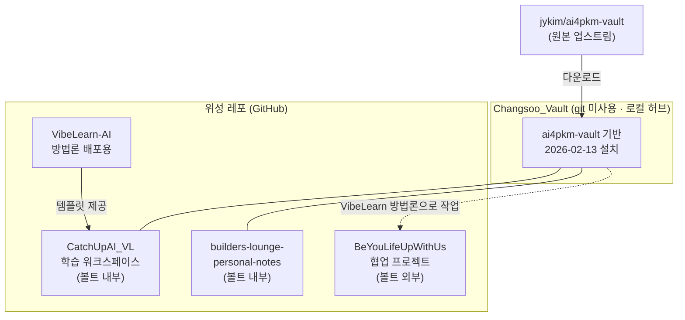
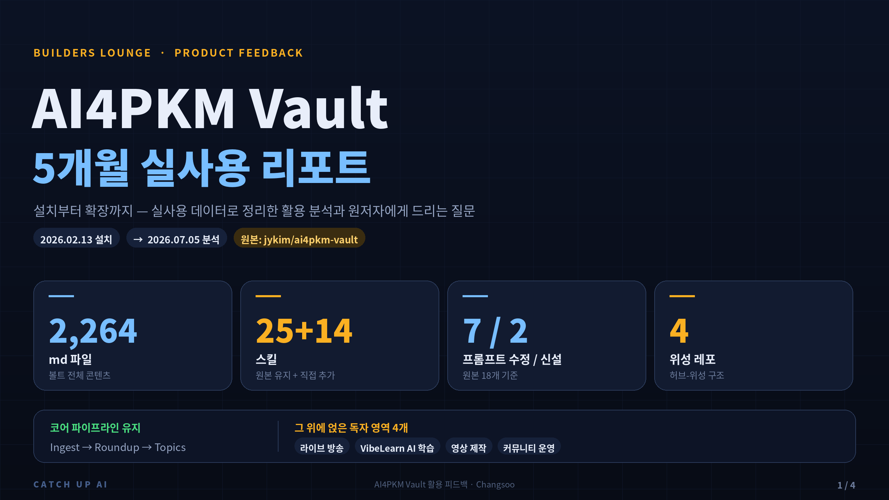
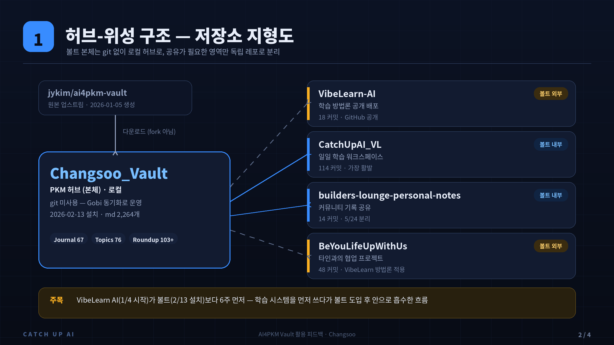
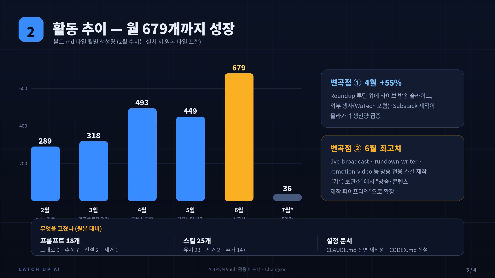
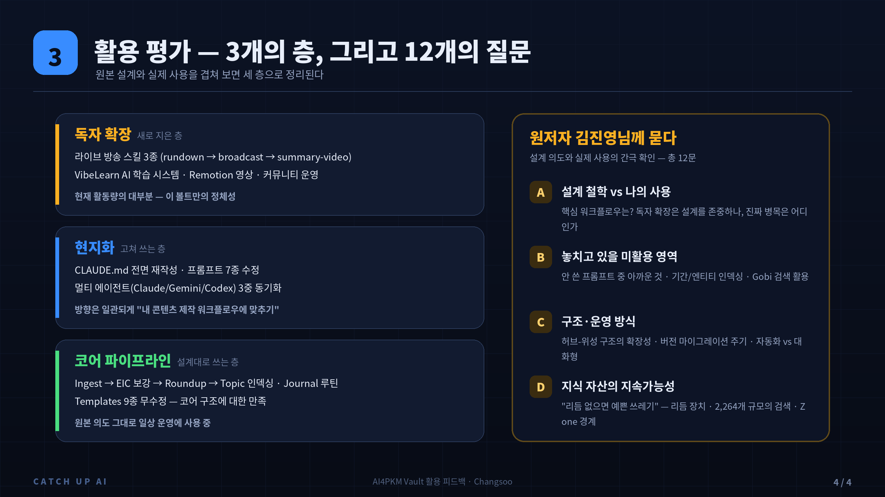
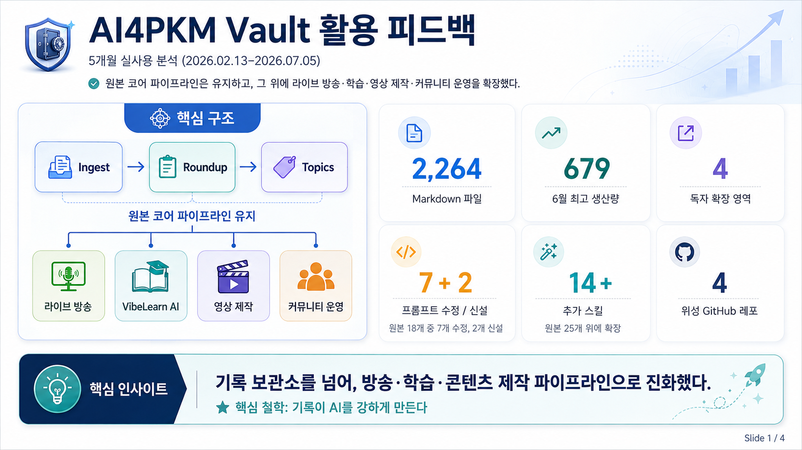
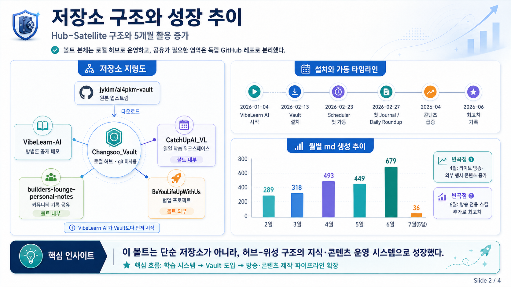
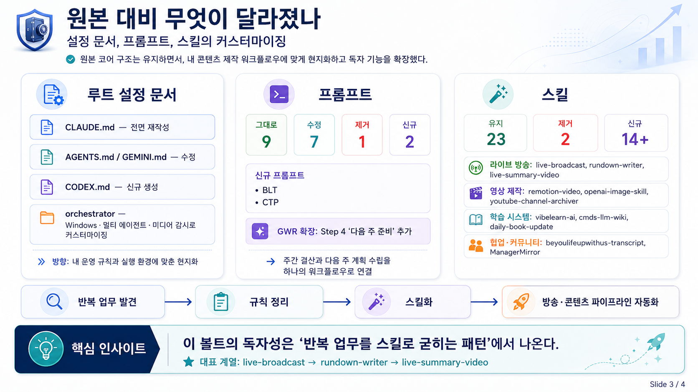
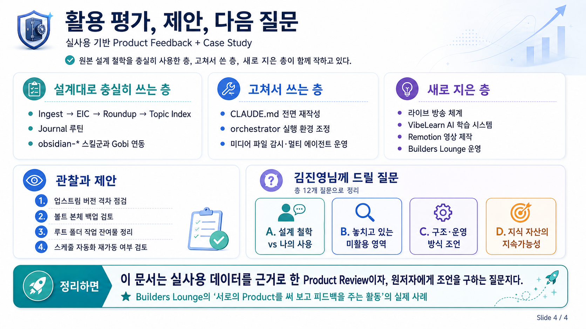

## 관련 문서

- [AI4PKM](<../../../../Topics/AI4PKM.md>)
- [2026-07-04 Kim Jin-young - Beyond LLM Wiki](<../ideas/2026-07-04 Kim Jin-young - Beyond LLM Wiki.md>)

## 한 줄 요약

김진영님이 만드신 ai4pkm-vault를 2026년 2월 13일부터 약 5개월간 사용하며 실사용 데이터를 분석했다. 원본 코어 파이프라인(Ingest → Roundup → Topics)은 그대로 유지하면서, 그 위에 라이브 방송·VibeLearn AI 학습 시스템·영상 제작·커뮤니티 운영이라는 독자 영역을 얹어 확장했다. 이 문서는 Builders Lounge의 "서로의 Product를 사용해 보고 피드백을 주는" 활동의 일환으로, 실제 활용 데이터를 근거로 정리한 피드백이자 원저자에게 조언을 구하는 질문지다.

## 요약

Changsoo_Vault는 2026년 2월 13일 원본 `jykim/ai4pkm-vault`를 기반으로 설치되어 약 5개월간 운영되고 있다. 원본이 제공한 파이프라인(Ingest → Roundup → Topics)과 스킬 체계는 그대로 유지하면서, 그 위에 라이브 방송 체계, VibeLearn AI 학습 시스템, 영상 제작, 커뮤니티 운영이라는 4개의 독자 영역을 얹은 형태로 진화했다. 원본 프롬프트 18개 중 7개를 수정하고 2개를 신설했으며, 스킬은 원본 25개에 14개 이상을 추가했다. 콘텐츠는 마크다운 기준 약 2,264개 파일로 성장했고, 월별 생산량은 설치 이후 꾸준히 증가해 6월에 최고치(679개)를 기록했다. 특징적인 점은 볼트 본체는 git 없이 운영하면서, 목적별로 4개의 독립 GitHub 레포(위성 레포)를 볼트 안팎에 배치한 "허브-위성" 구조를 만들었다는 것이다.

## 1. 저장소 지형도

Changsoo_Vault를 중심으로 5개의 저장소가 역할을 나누어 작동한다. 볼트 본체는 git으로 추적하지 않고(다운로드 방식), 공유가 필요한 영역만 독립 레포로 분리해 푸시하는 구조다.

| 저장소                                     | 생성일             | 커밋 수    | 역할                        | 위치                                    |
| --------------------------------------- | --------------- | ------- | ------------------------- | ------------------------------------- |
| jykim/ai4pkm-vault (원본)                 | 2026-01-05      | —       | 볼트 시스템 원본 (업스트림)          | GitHub                                |
| Changsoo_Vault                          | 2026-02-13 설치   | git 미사용 | PKM 허브 (본체)               | 로컬                                    |
| solkit70/VibeLearn-AI                   | 2026-01-04      | 18      | 학습 방법론(CUA_VL v2.0) 공개 배포 | GitHub 공개                             |
| solkit70/CatchUpAI_VL                   | 2026-01-04      | 114     | 일일 학습 워크스페이스              | 볼트 내 `Ingest/CatchUpAI_VL`            |
| solkit70/builders-lounge-personal-notes | 2026-05-24      | 14      | 커뮤니티 기록 공유                | 볼트 내 `AI/Initiatives/Builders Lounge` |
| solkit70/BeYouLifeUpWithUs              | 2026-03-19 첫 커밋 | 48      | 타인과의 협업 프로젝트              | 볼트 외부 (VibeLearn 방법론으로 작업)            |

주목할 점은 VibeLearn AI(CUA_VL)가 볼트보다 **먼저** 시작되었다는 것이다(1월 4일 vs 2월 13일). 즉 학습 시스템을 먼저 만들어 쓰다가, 약 6주 후 ai4pkm-vault를 도입하면서 학습 워크스페이스를 볼트 안으로 흡수한 흐름이다.

## 2. 설치 시점과 초기 가동

파일 생성 시간 기준으로 설치와 가동 과정이 명확하게 재구성된다. 2026-02-13 오후 11시 7분에 `.gobi/syncfiles`가 처음 생성되었고 4분 뒤 스킬 세트가 배치된 것으로 보아, **Gobi 동기화를 통해 2026년 2월 13일 밤에 설치**되었다. 이후 열흘간 세팅 기간을 거쳐 2월 23일부터 오케스트레이터 스케줄 작업이 돌기 시작했고, 2월 27일에 첫 Journal과 첫 Daily Roundup이 생성되며 본격 운영에 들어갔다.

| 날짜               | 이벤트                                   | 근거                                                                |
| ---------------- | ------------------------------------- | ----------------------------------------------------------------- |
| 2026-02-13 23:07 | 볼트 설치 (Gobi 동기화)                      | `.gobi/syncfiles` 생성 시간                                           |
| 2026-02-13 23:11 | 원본 스킬 25종 배치                          | `.claude/skills/*` 생성 시간                                          |
| 2026-02-23       | 스케줄 워크플로우 첫 가동 (DRB 05:00, TIU 04:30) | `_Settings_/Tasks` 첫 로그                                           |
| 2026-02-27       | 첫 Journal, 첫 Daily Roundup            | `Journal/2026-02-27.md`, `AI/Roundup/2026-02-27 - Claude Code.md` |

## 3. 활동 추이 — 언제부터 얼마나 사용했는가

마크다운 파일 생성량(볼트 전체, 총 2,264개)과 학습 레포 커밋 수를 함께 보면 활용 곡선이 드러난다. 2월 수치에는 설치 시 들어온 원본 파일이 포함되어 있으므로, 실질 생산은 3월부터 읽는 것이 정확하다.

| 월             | 볼트 md 생성 | CatchUpAI_VL 커밋 | 주요 활동                                                                     |
| ------------- | -------- | --------------- | ------------------------------------------------------------------------- |
| 2026-01       | (설치 전)   | 20              | CUA_VL v2.0 학습 시스템 독립 운영                                                  |
| 2026-02       | 289      | 30              | 볼트 설치, 스케줄 워크플로우 가동                                                       |
| 2026-03       | 318      | 26              | EIC/TIU 워크플로우 정착, BeYouLifeUpWithUs 시작 (3/19)                             |
| 2026-04       | 493      | 11              | 콘텐츠 급증 — AI in Action Live 슬라이드, WaTech 포럼, Substack                      |
| 2026-05       | 449      | 11              | Builders Lounge 레포 분리 (5/24), 첫 정식 모임                                     |
| 2026-06       | 679      | 15              | **최고치** — Live 방송 체계 고도화, Remotion 영상, Rundown 시스템                        |
| 2026-07 (5일간) | 36       | 1               | Live #17 방송, 커피챗 준비, 주간 뉴스레터 신설, 방송 요약 영상 스킬화(live-summary-video), GWR 확장 |

활용이 뚜렷하게 증가한 변곡점은 두 번이다. 첫 번째는 **4월** — Daily/Weekly Roundup 루틴 위에 라이브 방송 슬라이드와 외부 행사(WaTech 포럼) 콘텐츠 제작이 올라가면서 생산량이 55% 증가했다. 두 번째는 **6월** — live-broadcast·rundown-writer·remotion-video 등 방송 전용 스킬을 직접 만들어 붙이면서 볼트가 "기록 보관소"에서 "방송·콘텐츠 제작 파이프라인"으로 확장됐고 월 생산량이 최고치를 찍었다.

## 4. 원본 대비 무엇이 수정되었는가

### 루트 설정 문서

| 파일                                                  | 상태               | 변화 내용                                                                                                                             |
| --------------------------------------------------- | ---------------- | --------------------------------------------------------------------------------------------------------------------------------- |
| CLAUDE.md                                           | 전면 재작성 (73→122줄) | 원본을 AGENTS.md 참조 구조로 바꾸고, TodoWrite 규칙·워크플로우 커밋 포맷·Canvas 저장 경로·라이브 방송/Rundown/Remotion/VibeLearn/방송 요약 영상 스킬 게이트 등 자체 운영 규칙으로 교체 |
| AGENTS.md                                           | 수정 (189→198줄)    | VibeLearn AI 학습 게이트, BeYouLifeUpWithUs 워크플로우, Limitless 링크 포맷, 자체 스킬 목록 등 추가                                                      |
| GEMINI.md                                           | 수정 (26→67줄)      | 멀티 에이전트(Claude/Gemini/Codex) 운영 반영, 스킬 트리거 동기화                                                                                    |
| CODEX.md                                            | **신규 생성** (71줄)  | 원본에 없던 Codex 전용 설정 문서 — 스킬 트리거를 CLAUDE.md/GEMINI.md와 3중 동기화해 어느 AI 도구를 쓰든 같은 스킬이 발동되도록 운영                                         |
| orchestrator.yaml                                   | 수정               | 아래 상세                                                                                                                             |
| BRAIN_PROMPT.md, README.md, VAULTS.md, Templates 9종 | 원본 그대로           | 미수정                                                                                                                               |

orchestrator.yaml의 수정은 활용 방식을 잘 보여준다. `skills_dir`을 `.claude/skills`에서 `_Settings_/Skills`로 옮겨 볼트 안에서 스킬을 직접 관리하고, 감시 대상 확장자에 미디어 파일(mkv/mp4/m4a/mp3/wav)을 추가했으며, Claude Code·Gemini 실행 경로를 명시한 executors 설정을 넣었고, 자체 워크플로우인 BLT(BeYouLifeUpWithUs Transcript)를 오케스트레이터 작업으로 등록했다. 반면 로컬 버전은 0.0.19로 업스트림(0.0.30)보다 뒤처져 있어, 원본의 이후 개선(예: DRB 스케줄, ACB capture 설정)은 반영되지 않은 상태다.

### 프롬프트 (원본 18개 기준)

| 구분          | 항목                                                                       |
| ----------- | ------------------------------------------------------------------------ |
| 그대로 사용 (9)  | ARP, DDO, DIR, DRB, EDM, ICB, IWA, TIU, Prompts/README                   |
| 수정해서 사용 (7) | ACB, CBH, EIC, GDR, **GWR**, PBU, RVA                                    |
| 제거 (1)      | PPC (Post-Process Capture)                                               |
| 신규 추가 (2)   | **BLT** (BeYouLifeUpWithUs Transcript), **CTP** (Create Thread Postings) |

가장 최근 수정은 GWR(Generate Weekly Roundup)이다(7/5). 원본의 3단계 프로세스(템플릿 → 하이라이트 → 종합) 뒤에 **Step 4 "다음 주 준비"를 추가**해, Weekly Roundup을 마치면 다음 주 계획 파일 3종(Weekly Progress and Planning, Weekly Dashboard.canvas, Live{N+1} Weekly Rundown)을 자동으로 확인·생성하도록 확장했다. 주간 결산과 다음 주 계획 수립이 하나의 워크플로우로 이어지는 구조이며, 주간 관리 기간도 일~일 8일(일요일이 두 주에 겹침)이라는 자체 관행으로 운영 중이다.

`_Settings_/Tasks`의 실행 로그(2/23~4/26, 58건)를 보면 실제로 가장 많이 돌린 워크플로우는 TIU(Topic Index Update)와 EIC(Enrich Ingested Content)로, 원본이 설계한 "수집 → 보강 → 인덱싱" 파이프라인을 충실히 사용했다. 다만 스케줄 실행 로그가 4월 말 이후 끊긴 것으로 보아, 이후에는 cron 자동 실행보다 Claude Code와의 대화형 실행으로 운영 방식이 옮겨간 것으로 보인다.

### 스킬 (원본 25개 기준)

원본 스킬 중 23개를 유지하고 2개(create-gif-slides, road-trip-planning)를 제거했으며, **14개 이상을 직접 추가**했다. 추가된 스킬이 곧 이 볼트의 독자 영역이다.

| 영역      | 직접 추가한 스킬                                                                                        |
| ------- | ------------------------------------------------------------------------------------------------ |
| 라이브 방송  | live-broadcast, rundown-writer, **live-summary-video** (7/5 신규)                                  |
| 영상 제작   | remotion-video, openai-image-skill, youtube-channel-archiver                                     |
| 학습 시스템  | vibelearn-ai, cua-vl(.claude), cmds-llm-wiki, daily-book-update                                  |
| 협업·커뮤니티 | beyoulifeupwithus-transcript, ManagerMirror(외부 레포 클론)                                            |
| 기타 실험   | finviz-collector, create-gobi-homepage, ai4pkm-helper, bedtime-story, hello-skill, youtube-to-md |

특히 `bedtime-story`, `hello-skill` 같은 연습용 스킬이 남아 있는 것은 스킬 제작 자체를 학습 주제로 다뤘다는 흔적이고("Skill로 나의 반복 업무 자동화 하기" Live 실험과 연결), live-broadcast → rundown-writer → live-summary-video로 이어지는 스킬 계열은 반복 업무에서 규칙을 발견하면 스킬로 굳히는 패턴이 자리잡았음을 보여준다.

가장 최근 사례인 live-summary-video(7/5)는 이 패턴이 한 단계 발전한 형태다. 매주 반복되는 "방송 요약 영상 제작"에서 실행(remotion-video)이 아니라 **컨텍스트 수집 단계를 별도 스킬로 분리**했다 — 유튜브 자막 확인(비동기 생성이라 후속 Task 규칙 포함), 방송 당일 기록 7종(GOBI Capture 전사, 챗히스토리, Claude Code/Codex 세션 로그, 당일 작업 파일 전체 스캔, GitHub push 내용), 주간 기록(Rundown·Roundup)을 모아 메인 테마를 확정한 뒤 기존 remotion-video 스킬로 핸드오프하는 구조다. AI 작업 기록 자체(세션 로그, 커밋)를 다음 콘텐츠의 데이터 소스로 재사용한다는 점에서, ai4pkm-vault의 "기록이 AI를 강하게 만든다" 철학을 스킬 설계에 그대로 적용한 사례라고 볼 수 있다.

## 5. 무엇이 새로 만들어졌는가 — 콘텐츠 생산

원본 레포는 설정과 문서만 담고 있으므로(콘텐츠 폴더 없음), 아래 콘텐츠는 전부 5개월간의 생산물이다.

| 폴더                  | md 파일 수 | 내용                                                                                               |
| ------------------- | ------- | ------------------------------------------------------------------------------------------------ |
| Ingest/CatchUpAI_VL | 1,315   | VibeLearn AI 학습 워크스페이스 — 학습 Topic 19개 (Bila-AI-Agent, Remotion, Peter-Thiel-Vision, Qwen3-TTS 등) |
| Ingest/YouTube      | 420     | youtube-channel-archiver로 수집한 영상 transcript                                                      |
| Ingest/Transcripts  | 89      | BeYouLifeUpWithUs 회의 등 트랜스크립트 아카이브                                                               |
| Ingest/Clippings    | 53      | 웹 클리핑 (EIC 처리)                                                                                   |
| AI/Roundup          | 103+    | Daily/Weekly Roundup, Live Weekly Rundown (Live #17까지)                                           |
| AI/Initiatives      | 43      | Builders Lounge 운영 기록 (독립 레포)                                                                    |
| AI/Summary·Research | 49      | 분석·요약 문서                                                                                         |
| Topics              | 76      | 주제 인덱스 (AI4PKM, CMDS, Changbal, CatchUp AI 등)                                                    |
| Journal             | 67      | 일일 저널 (2026-02-27 ~ 07-05, 거의 매일)                                                                |
| Content-Creation    | —       | Substack, YouTube 썸네일 등 발행 자산                                                                    |

## 6. 활용 평가 — 원본 설계 vs 나의 사용

원본 ai4pkm-vault가 설계한 것과 실제 사용을 겹쳐 보면 세 층으로 정리된다.

**설계대로 충실히 쓰는 층 (코어 파이프라인)**: Ingest → EIC 보강 → Daily/Weekly Roundup → Topic 인덱싱 흐름, Journal 루틴, obsidian-* 스킬군(links, frontmatter, canvas, mermaid), Gobi 연동(Brain, Space)은 원본 의도 그대로 일상 운영에 사용 중이다. Templates 9종을 하나도 고치지 않은 것도 코어 구조에 대한 만족도를 보여준다.

**고쳐서 쓰는 층 (현지화)**: CLAUDE.md 전면 재작성, orchestrator 실행 환경(Windows 경로, 멀티 에이전트) 명시, EIC/GDR 등 프롬프트 6종 수정, 미디어 파일 감시 추가. 수정의 방향은 일관되게 "내 콘텐츠 제작 워크플로우에 맞추기"다.

**새로 지은 층 (독자 확장)**: 라이브 방송 체계(Rundown 문서 규격 + 전용 스킬 3종: live-broadcast·rundown-writer·live-summary-video), VibeLearn AI 학습 시스템(볼트 밖에서 시작해 볼트 안으로 통합), Remotion 영상 제작 파이프라인, Builders Lounge 커뮤니티 운영, 위성 레포 구조 자체. 이 층이 현재 볼트 활동량의 대부분을 차지하며, 원본에는 없는 이 볼트만의 정체성이다. 특히 방송 루틴은 "방송 전 계획(rundown-writer) → 방송 중 보조(live-broadcast) → 방송 후 결산·다음 주 준비(GWR Step 4) → 요약 영상 컨텍스트 수집(live-summary-video)"까지 주간 사이클 전체가 스킬·프롬프트로 커버되는 수준에 도달했다.

## 7. 관찰과 제안

분석 과정에서 발견한, 검토해 볼 만한 사항들이다.

1. **업스트림 버전 격차**: 로컬 orchestrator는 0.0.19, 원본은 0.0.30까지 진행됐고 원본 레포도 2026-05-26까지 업데이트되었다. `gobi-migration` 스킬이 바로 이런 버전 마이그레이션 용도이므로, 원본의 개선분(DRB 스케줄 개선, capture 설정 등)을 선별 반영할 수 있다.
2. **볼트 본체의 백업 부재**: 위성 레포 4개는 GitHub에 있지만 볼트 본체(Journal, Topics, Roundup 등 핵심 자산)는 git이 없어 Gobi 동기화에만 의존한다. 본체도 사설 레포로 백업할지 검토할 가치가 있다.
3. **루트 폴더의 작업 잔여물**: `fetch_calendar.py`, `*_threads.json`, `Untitled.canvas` 등 실험 파일들이 볼트 루트에 쌓여 있다. `_Sandbox_`나 `_Archive_`로 정리하면 원본의 깔끔한 루트 구조를 회복할 수 있다.
4. **스케줄 자동화의 휴면**: 4월 말 이후 오케스트레이터 스케줄 로그가 없다. 대화형 운영으로 충분하다면 orchestrator의 cron 항목을 정리하고, 자동화가 다시 필요하면 재가동하면 된다.

## 8. 김진영님께 드릴 질문 (Utilization Advice)

이 문서는 원저자 김진영님께 "내가 ai4pkm-vault를 얼마나 잘 활용하고 있는지, 어떤 점을 놓치고 있는지" 조언을 구하기 위한 자료다. 김진영님은 이 시스템의 설계자이자 LLMWiki 기반 지식관리 실전 연구자(Beyond LLM Wiki, CMDS 2026-07-02 발표)이므로, 아래 질문들은 설계 의도와 실제 사용의 간극을 확인하는 데 초점을 맞췄다. → **관련 발표**: [2026-07-04 Kim Jin-young - Beyond LLM Wiki](<../ideas/2026-07-04 Kim Jin-young - Beyond LLM Wiki.md>)

### A. 설계 철학 vs 나의 사용 방식

1. 원래 ai4pkm-vault를 설계하실 때 **가장 핵심이라고 생각하신 워크플로우 한두 개**는 무엇인가요? 제가 실제로 가장 많이 쓴 것은 EIC(수집 보강)와 TIU(Topic 인덱싱)인데, 설계 의도와 일치하나요?
2. 저는 볼트 위에 라이브 방송·영상 제작·커뮤니티 운영이라는 독자 영역을 크게 얹었습니다. 이런 확장이 **원본 구조를 존중하는 방향**인가요, 아니면 원본이 의도한 흐름을 흐트러뜨리는 부분이 있나요?
3. Beyond LLM Wiki에서 말씀하신 "**병목 진단 먼저**" 관점에서, 제 볼트 활용의 진짜 병목은 수집·정리·검색·생산 중 어디로 보이시나요?

### B. 내가 놓치고 있을 미활용 영역

4. 원본 프롬프트 18개 중 제가 거의 안 쓴 것들(ARP, ICB, DRB 등)이 있습니다. **놓치면 아까운 기능**은 무엇인가요?
5. Topic 인덱스를 토픽 단위로만 쌓고 있는데, 발표에서 언급하신 **기간(Daily/Weekly)·프로젝트·엔티티 단위 인덱싱**을 이 볼트에서는 어떻게 적용하면 좋을까요?
6. Gobi Brain / Space 연동을 지금은 커뮤니티 소통 위주로만 쓰는데, **지식 검색·컴파일 측면에서 더 활용할 여지**가 있나요?

### C. 구조·운영 방식에 대한 조언

7. 저는 볼트 본체는 git 없이 두고, 목적별로 4개 위성 레포(VibeLearn-AI, CatchUpAI_VL, Builders Lounge, BeYouLifeUpWithUs)를 분리한 **허브-위성 구조**를 만들었습니다. 이 방식이 확장 가능한 패턴인가요, 아니면 나중에 관리가 어려워질 위험이 있나요?
8. 로컬 orchestrator가 0.0.19에 머물러 있는데(원본 0.0.30), **버전 마이그레이션을 어느 주기로, 어떤 방식으로** 하는 것이 좋을까요? 커스터마이징이 많아 충돌이 걱정됩니다.
9. 4월 말 이후 cron 자동화가 멈추고 Claude Code 대화형 운영으로 넘어갔습니다. 설계자 입장에서 **자동화(스케줄)와 대화형 실행의 이상적인 균형**은 어느 정도인가요?

### D. 지식 자산의 지속가능성

10. 발표에서 "**리듬이 없으면 예쁜 쓰레기**"라고 하셨는데, 제 Topic 76개·Journal 67개가 실제로 업데이트되며 살아있게 유지하려면 어떤 리듬 장치를 넣어야 할까요?
11. 콘텐츠가 2,264개 md 파일로 커졌습니다. 이 규모에서 **검색·재사용이 무너지지 않게** 하려면 지금 무엇을 정비해야 하나요?
12. 자동화(EIC, TIU)가 만든 문서와 제가 직접 쓴 문서가 섞여 있습니다. 발표의 **Human/Shared/AI Zone 경계** 개념을 이 볼트에 적용한다면 어떻게 나누는 것이 좋을까요?

## Bila 연결 포인트

- Builders Lounge Product Discovery Platform의 "서로의 첫 사용자가 되어 feedback을 주는" 활동의 실제 사례 — 이 경우 대상 Product는 ai4pkm-vault 자체다.
- 김진영님과의 Beyond LLM Wiki 발표(7/2)에서 나온 프레임워크(병목 진단, 인덱싱 축, 업데이트 리듬, Zone 경계)를 실제 사용 사례에 적용해 본 교차 검증이기도 하다.

## 인포그래픽 요약 (실험: ChatGPT vs Gemini vs Claude Fable 5)

이 문서의 내용을 세 가지 AI 도구로 각각 인포그래픽으로 요약해 봤다. 같은 문서를 입력으로 어떤 결과가 나오는지 비교하는 실험을 겸한다.

### Claude Fable 5 (4장)

### ChatGPT (4장)

### Gemini (1장)

*2026-07-05 작성. 로컬 파일 생성 시간 + 위성 레포 git log + GitHub API 기반 분석. 🤖 [Claude Code](https://claude.ai/code)로 작성.*
