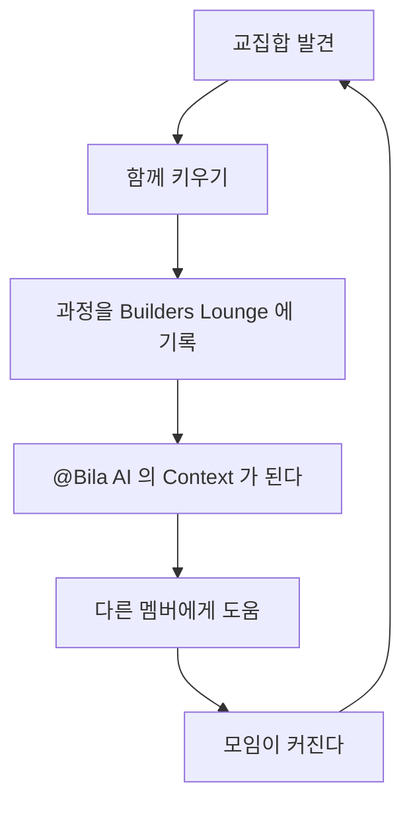

## 한 줄 요약

**Builders Lounge 는 모임과 멤버 사이의 교집합을 찾아 함께 키우면서 서로의 성장을 도모한다.** 교집합은 세 단계로 넓어진다. 모임과 멤버의 회사, 모임과 멤버가 운영하는 다른 모임, 그리고 멤버와 멤버 사이다. 그 과정을 기록으로 남기면 다른 멤버에게도 도움이 되고, 모임이 커지면서 새 교집합이 또 생긴다. 박창수가 그리는 Builders Lounge 의 앞으로의 모습 중 하나다.

→ **원문**: [[Journal/2026-09-25#Builders Lounge 계획 — 모임과 멤버의 비지니스 교집합을 함께 키운다 (구술 원문)|2026-09-25 박창수 구술 원문]]

## 교집합의 세 단계

| 단계 | 사례 | 상대가 얻는 것 | Builders Lounge 가 얻는 것 | 상태 |
|---|---|---|---|---|
| **① 모임 ↔ 멤버의 회사** | GOBI Space 의 Builders Lounge 채널과 @Bila AI | 실제 모임 현장에서 나오는 생생한 Requirements 를 제품에 반영할 기회 | AI Agent 로 모임 활동을 돕는 온라인 공간 | 진행 중 |
| **② 모임 ↔ 멤버가 운영하는 모임** | 창발 Product 팀과 Builders Lounge 의 세미나 공동 주최 | (논의 예정) | 첫 후보는 송재희 님 온라인 특강 | 2026-09-25 박세진 님께 제안 |
| **③ 멤버 ↔ 멤버** | 멤버들이 서로의 비지니스 교집합을 찾아 함께 진행하는 아이템 | 서로의 성장 | 그 과정의 기록 → 다른 멤버에게 도움, 모임 성장 | 앞으로 |

### ① GOBI 와의 관계 — 지금 가장 구체적인 Best Practice

GOBI Space 의 Builders Lounge 채널은 **GOBI 회사 입장에서는 비지니스의 일부**이고, **Builders Lounge 입장에서도 모임 활동의 일부**다. 모임을 진행하면서 필요해지는 기능을 Requirements 로 삼아 채널 기능과 @Bila AI Agent 기능을 계속 보완해 나간다. 어느 한쪽이 다른 쪽을 돕는 관계가 아니라, **같은 채널이 양쪽 모두의 성장 도구가 되는 구조**다.

> "이렇게 Builders Lounge 와 GOBI 와의 관계가 이 모임과 멤버간의 교집합을 서로 키우면서 서로의 비지니스 성장을 도모하는 좋은 Best Practice 가 될 수 있을 겁니다." — [[Journal/2026-09-25#Builders Lounge 계획 — 모임과 멤버의 비지니스 교집합을 함께 키운다 (구술 원문)|박창수 구술]]

### ② 창발 Product 팀과의 공동 주최

박세진 님은 창발의 Product 그룹을 운영하시고 Builders Lounge 멤버이기도 하다. 두 모임의 방향이 맞는 세미나는 공동으로 주최하자고 제안했고, 첫 예로 송재희 님 온라인 특강을 들었다. ①과 같은 원리를 **회사가 아닌 모임과 모임 사이**에 적용한 사례다.

→ **제안 내용과 다음 할 일**: [[Initiatives/Builders Lounge/ideas/2026-09-25 Builders Lounge 온라인 특강 기획 - 송재희님#창발 Product 팀과 공동 주최 제안 — 박세진님 (2026-09-25)|공동 주최 제안]]

### ③ 멤버와 멤버 사이로

Builders Lounge 는 서로의 성장을 도울 수 있는 멤버 간 교집합을 계속 찾아 나간다. 동시에 멤버들도 스스로 교집합을 찾아 함께 성장할 비지니스 아이템을 진행할 수 있다. 모임이 연결을 주선하는 데서 그치지 않고, **멤버들이 직접 만들어 가는 단계**로 넘어가는 것이다.

## 기록이 만드는 선순환

이 구상에서 기록이 중요한 이유가 여기 있다. 교집합을 키운 과정이 기록으로 남으면 다른 멤버의 참고가 되고, @Bila AI 가 그 기록을 바탕으로 멤버를 이어 줄 수 있다. 모임이 커질수록 교집합이 생길 자리도 늘어난다.

## 이미 있는 구상과의 연결

- **@Bila AI 멤버 매칭**: 서로 도움이 될 멤버를 이어 주는 기능은 CTS 부스 페이지의 「여기 오면 얻는 것」 네 번째 카드로 이미 소개하고 있다. 이 구상은 그 매칭이 **무엇을 향하는지**, 곧 비지니스 교집합을 설명한다 → [[Initiatives/Builders Lounge/ideas/2026-09-23 CTS 2026 Builders Lounge 홍보 부스#진행 — 홍보 페이지 로컬 초안 (2026-09-25)|CTS 부스 페이지]]
- **1대1 교류**: 7/29 박세진 님과의 우연한 대화에서 정기 모임 밖의 1대1 교류가 유익하다는 것을 확인했다. ③ 단계의 출발점이다 → [[Initiatives/Builders Lounge/ideas/2026-07-29 Builders Lounge 멤버 간 1대1 교류 활성화 - Bila AI 매칭 전 실천|1대1 교류 활성화]]
- **AI 코디네이터**: [[Initiatives/Builders Lounge/ideas/2026-05-30 Builders Lounge AI 코디네이터 구상|AI 코디네이터 구상]]
