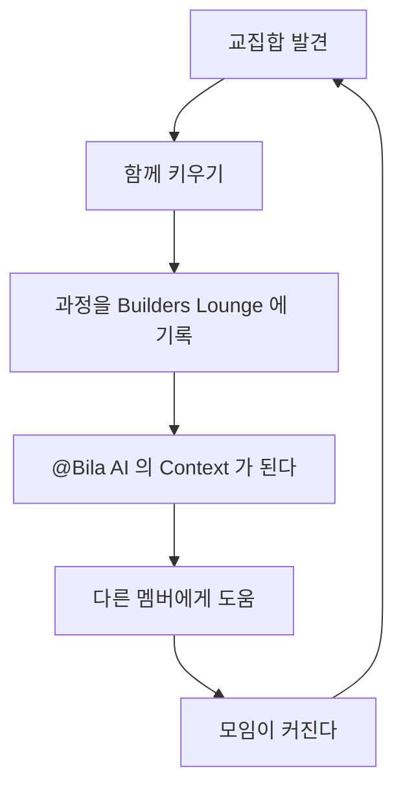

## 한 줄 요약

**Builders Lounge 는 모임과 멤버 사이의 교집합을 찾아 함께 키우면서 서로의 성장을 도모한다.** 교집합은 세 단계로 넓어진다. 모임과 멤버의 회사, 모임과 멤버가 운영하는 다른 모임, 그리고 멤버와 멤버 사이다. 그 과정을 기록으로 남기면 다른 멤버에게도 도움이 되고, 모임이 커지면서 새 교집합이 또 생긴다. 박창수가 그리는 Builders Lounge 의 앞으로의 모습 중 하나다.

→ **원문**: [[Journal/2026-09-25#Builders Lounge 계획 — 모임과 멤버의 비지니스 교집합을 함께 키운다 (구술 원문)|2026-09-25 박창수 구술 원문]] · [[Journal/2026-09-29#CTS 부스 홍보 페이지에 교집합 구상 넣기 (구술 원문)|2026-09-29 구술]]

## 구상 정리 — 한 편의 글 (2026-09-29)

> CTS 부스 홍보 페이지에 넣기 위해 흩어진 기록을 한 편으로 모았다. 소스: 9/25 구술 원문 · 이 문서의 세 단계 표 · 청사진 HTML 06 절 · 9/29 구술 (「멤버와 모임 그리고 멤버와 멤버와의 교집합을 찾아서 그 부분을 성장시킴으로서 모임과 멤버가 같이 성장하는 개념」).

### 교집합을 찾아 함께 키운다

Builders Lounge 는 AI 로 무언가를 만드는 사람들이 모이는 곳이다. 이 모임이 지향하는 것은 한 가지다. **모임과 멤버 사이, 그리고 멤버와 멤버 사이에서 서로 겹치는 부분 — 교집합 — 을 찾아내고, 그 부분을 함께 키워서 모임과 멤버가 같이 성장하는 것**이다. 모임이 멤버에게 무언가를 일방적으로 주거나, 멤버가 모임을 위해 봉사하는 관계가 아니다. 서로 겹치는 교집합을 찾아 키우면 양쪽이 함께 잘되는 것이다.

가장 먼저 보이는 교집합은 **모임과 멤버의 회사 사이**에 있다. 지금 Builders Lounge 의 온라인 공간은 멤버인 강민석 님의 회사 GOBI 가 만든 GOBI Space 안의 Builders Lounge 채널이다. GOBI 에게 이 채널은 비지니스의 일부이고, Builders Lounge 에게는 모임 활동의 일부다. 모임을 하면서 필요해지는 기능을 요구사항으로 삼아 채널과 @Bila AI Agent 를 계속 보완해 나가면, GOBI 는 실제 현장의 생생한 요구를 제품에 반영하고, Builders Lounge 는 AI Agent 가 돕는 온라인 공간을 얻는다. 같은 채널이 양쪽 모두의 성장 도구가 되는 이 관계가 지금 가장 구체적인 사례다.

교집합은 **모임과 모임 사이**로도 넓어진다. 멤버인 박세진 님이 운영하는 창발 Product 팀과 Builders Lounge 가 방향이 맞는 세미나를 함께 주최하자고 제안했고, 첫 후보가 송재희 님의 온라인 특강이다. 두 모임이 각자의 청중을 나누면 한 모임이 혼자 할 때보다 더 많은 사람에게 닿는다.

그리고 궁극적으로 교집합은 **멤버와 멤버 사이**에서 생긴다. Builders Lounge 는 서로의 성장을 도울 수 있는 멤버 사이의 교집합을 계속 찾아 이어 주고, 멤버들도 스스로 그 교집합을 찾아 함께 진행할 비지니스 아이템을 만들어 간다. 모임이 연결을 주선하는 데서 멈추지 않고, 멤버들이 직접 만들어 가는 단계로 넘어가는 것이다.

이 모든 과정에서 중요한 것은 **기록**이다. 교집합을 키운 과정을 Builders Lounge 에 남기면 그 기록은 다른 멤버에게 참고가 되고, @Bila AI 가 그 기록을 바탕으로 또 다른 멤버를 이어 줄 수 있다. 그렇게 모임이 커지면 모임과 멤버, 멤버와 멤버 사이에 새로운 교집합이 또 생긴다. **교집합을 찾고 → 함께 키우고 → 기록으로 남기면 → 모임이 커지고 → 새 교집합이 생기는 선순환**, 이것이 Builders Lounge 가 그리는 앞으로의 모습이다.

### 홍보 페이지용 짧은 버전

**한 문장**
> Builders Lounge 는 모임과 멤버, 멤버와 멤버 사이의 교집합을 찾아 함께 키우며, 모임과 멤버가 같이 성장하는 곳입니다.

**세 문장 (그림 옆 설명용)**
> 당신이 만들고 있는 것과 이 모임이 겹치는 곳, 그리고 당신과 다른 멤버가 겹치는 곳이 있습니다. Builders Lounge 는 그 교집합을 찾아 함께 키웁니다 — 교집합을 키우면 양쪽 모두가 잘됩니다. 그 과정을 기록으로 남기면 다른 멤버에게도 도움이 되고, 모임이 커지면서 새로운 교집합이 또 생깁니다.

**English (페이지 EN 버전용)**
> Builders Lounge grows by finding where things overlap — between the community and its members, and between members — and growing that overlap together, so the community and its members grow at the same time. When what you're building overlaps with what this community needs, or with what another member is building, we help that overlap grow. We keep a record of each story, so it helps the next member and opens up new overlaps as the community grows.

### 그림으로 넣을 때 (초안 방향)

- **벤 다이어그램 하나**: 「Builders Lounge」 · 「빌더 A(멤버와 그의 회사)」 · 「빌더 B(다른 멤버 · 다른 모임)」 세 원이 겹치고, 겹친 부분에 사례를 짧게 — 「GOBI Space 채널 · @Bila AI」(모임 × 멤버 회사) · 「다른 모임과 함께 여는 세미나 · 커피챗」(모임 × 다른 모임, 예: 7/6 KACC 커피챗) · 「함께 만드는 아이템」(멤버 × 멤버)
- **아래에 한 줄 선순환**: 교집합 발견 → 함께 키우기 → 기록 → 모임 성장 → 새 교집합
- 사례에 GOBI 이름을 넣어도 되는지는 **강민석 님께 먼저 확인** (오늘 강민석 님 미팅 안건 1)
- **② 는 특정 단체를 정하지 않는다** (2026-09-29 박창수 결정). 창발 Product 팀과의 공동 세미나는 확정된 것이 없어 페이지에 넣지 않는다. 대신 「앱을 만드는 사람만 빌더가 아니다 — AI 로 세미나를 열고 사람을 잇는 모임도 빌더이고, Builders Lounge 도 그중 하나」라는 관점으로 다른 모임과의 공동 행사를 소개하고, 이미 한 KACC 커피챗을 예로 든다

## 교집합의 세 단계

| 단계 | 사례 | 상대가 얻는 것 | Builders Lounge 가 얻는 것 | 상태 |
|---|---|---|---|---|
| **① 모임 ↔ 멤버의 회사** | GOBI Space 의 Builders Lounge 채널과 @Bila AI | 실제 모임 현장에서 나오는 생생한 Requirements 를 제품에 반영할 기회 | AI Agent 로 모임 활동을 돕는 온라인 공간 | 진행 중 |
| **② 모임 ↔ 멤버가 운영하는 모임** | 창발 Product 팀과 Builders Lounge 의 세미나 공동 주최 | (논의 예정) | 첫 후보는 송재희 님 온라인 특강 | 2026-09-25 박세진 님께 제안 |
| **③ 멤버 ↔ 멤버** | 멤버들이 서로의 비지니스 교집합을 찾아 함께 진행하는 아이템 | 서로의 성장 | 그 과정의 기록 → 다른 멤버에게 도움, 모임 성장 | 앞으로 |

### ① GOBI 와의 관계 — 지금 가장 구체적인 Best Practice

GOBI Space 의 Builders Lounge 채널은 **GOBI 회사 입장에서는 비지니스의 일부**이고, **Builders Lounge 입장에서도 모임 활동의 일부**다. 모임을 진행하면서 필요해지는 기능을 Requirements 로 삼아 채널 기능과 @Bila AI Agent 기능을 계속 보완해 나간다. 어느 한쪽이 다른 쪽을 돕는 관계가 아니라, **같은 채널이 양쪽 모두의 성장 도구가 되는 구조**다.

> "이렇게 Builders Lounge 와 GOBI 와의 관계가 이 모임과 멤버간의 교집합을 서로 키우면서 서로의 비지니스 성장을 도모하는 좋은 Best Practice 가 될 수 있을 겁니다." — [[Journal/2026-09-25#Builders Lounge 계획 — 모임과 멤버의 비지니스 교집합을 함께 키운다 (구술 원문)|박창수 구술]]

### ② 창발 Product 팀과의 공동 주최

박세진 님은 창발의 Product 그룹을 운영하시고 Builders Lounge 멤버이기도 하다. 두 모임의 방향이 맞는 세미나는 공동으로 주최하자고 제안했고, 첫 예로 송재희 님 온라인 특강을 들었다. ①과 같은 원리를 **회사가 아닌 모임과 모임 사이**에 적용한 사례다.

→ **제안 내용과 다음 할 일**: [[Initiatives/Builders Lounge/ideas/2026-09-25 Builders Lounge 온라인 특강 기획 - 송재희님#창발 Product 팀과 공동 주최 제안 — 박세진님 (2026-09-25)|공동 주최 제안]]

### ③ 멤버와 멤버 사이로

Builders Lounge 는 서로의 성장을 도울 수 있는 멤버 간 교집합을 계속 찾아 나간다. 동시에 멤버들도 스스로 교집합을 찾아 함께 성장할 비지니스 아이템을 진행할 수 있다. 모임이 연결을 주선하는 데서 그치지 않고, **멤버들이 직접 만들어 가는 단계**로 넘어가는 것이다.

## 기록이 만드는 선순환

```mermaid
flowchart TB
    A["교집합 발견"] --> B["함께 키우기"]
    B --> C["과정을 Builders Lounge 에 기록"]
    C --> D["@Bila AI 의 Context 가 된다"]
    D --> E["다른 멤버에게 도움"]
    E --> F["모임이 커진다"]
    F --> A
```

이 구상에서 기록이 중요한 이유가 여기 있다. 교집합을 키운 과정이 기록으로 남으면 다른 멤버의 참고가 되고, @Bila AI 가 그 기록을 바탕으로 멤버를 이어 줄 수 있다. 모임이 커질수록 교집합이 생길 자리도 늘어난다.

## 이미 있는 구상과의 연결

- **@Bila AI 멤버 매칭**: 서로 도움이 될 멤버를 이어 주는 기능은 CTS 부스 페이지의 「여기 오면 얻는 것」 네 번째 카드로 이미 소개하고 있다. 이 구상은 그 매칭이 **무엇을 향하는지**, 곧 비지니스 교집합을 설명한다 → [[Initiatives/Builders Lounge/ideas/2026-09-23 CTS 2026 Builders Lounge 홍보 부스#진행 — 홍보 페이지 로컬 초안 (2026-09-25)|CTS 부스 페이지]]
- **1대1 교류**: 7/29 박세진 님과의 우연한 대화에서 정기 모임 밖의 1대1 교류가 유익하다는 것을 확인했다. ③ 단계의 출발점이다 → [[Initiatives/Builders Lounge/ideas/2026-07-29 Builders Lounge 멤버 간 1대1 교류 활성화 - Bila AI 매칭 전 실천|1대1 교류 활성화]]
- **AI 코디네이터**: [[Initiatives/Builders Lounge/ideas/2026-05-30 Builders Lounge AI 코디네이터 구상|AI 코디네이터 구상]]
