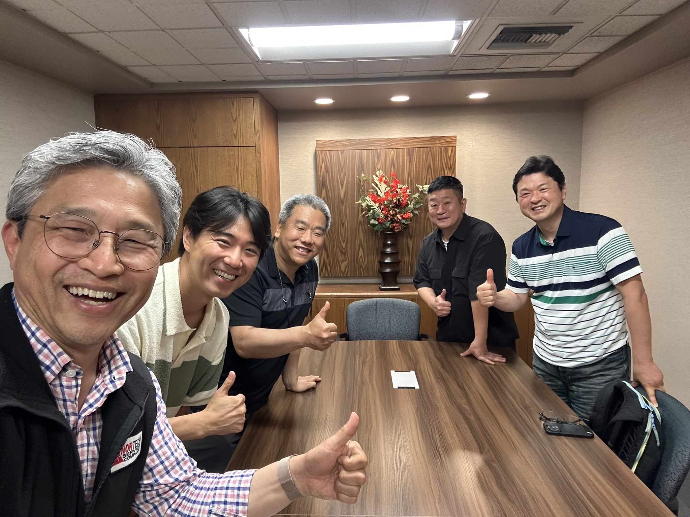

## 요약

이 문서는 2026년 7월 7일 Claude Code가 화자 구분이 끝난 transcript 전체(2시간 15분)를 직접 읽고 작성한 요약본이다. Builders Lounge 멤버 공유와, 이후 AI Agent가 이 대화를 컨텍스트로 활용할 때 참고할 수 있도록 작성했다.

2026년 7월 6일 월요일, Bellevue의 워싱턴주 한인상공회의소(KACC) 사무실에서 Builders Lounge와 KACC Coffee Chat이 진행됐다. 참석자는 오명규 회장님(KACC), 강민석님(GOBI), 이은석님(TecAce), 김성수님(HebronGuide), 박창수(Catch Up AI / Builders Lounge)였다.

대화는 크게 두 축으로 흘렀다. 하나는 KACC가 준비 중인 재외동포청 연계 프로그램에 Builders Lounge가 어떤 방식으로 연결될 수 있는가였고, 다른 하나는 각자의 제품(GOBI, TecAce, HebronGuide, Bizcrush 등)을 서로 비교·피드백하면서 자연스럽게 "환대(hospitality)"라는 키워드로 수렴한 커뮤니티 운영 철학 논의였다.

## 참석자와 제품/역할

| 참석자 | 소속/제품 | 이번 대화에서의 역할 |
| --- | --- | --- |
| 오명규 | 워싱턴주 한인상공회의소(KACC) 회장 | 재외동포청 파일럿 프로그램 배경 설명, 11월 정규 프로그램 구상, 상공회의소가 사업화·네트워크 연결 통로가 되는 방향 제안 |
| 강민석 | GOBI(AI 하드웨어 스타트업) | 컨퍼런스 부스용 안경형 캡처 디바이스 설명, SF와 시애틀의 스타트업 리스크테이킹 문화 차이 공유 |
| 이은석 | TecAce(시애틀 25년차 IT 회사) | FDE 방식 AI 도입 지원, 미팅노트를 넘어선 온톨로지 기반 업무 분석 프로덕트 소개, 지역 커뮤니티 활동 경험을 바탕으로 환대의 중요성 공유 |
| 김성수 | HebronGuide(목회자 겸 스타트업 대표) | 바이브 코딩으로 만든 이민자 환대 플랫폼(75개 도시) 소개, "환대"를 커뮤니티 운영 철학으로 제안 |
| 박창수 | Catch Up AI / Builders Lounge | Builders Lounge의 취지(서로의 첫 사용자 되기)와 3단계 AI 역할(Q&A → 매칭 → 코디네이팅) 설명 |

## KACC와 재외동포청 프로그램의 배경

오명규 회장님은 작년 재외동포청 산하 재외동포경제지원과가 주무부처가 되어 진행한 시애틀 데모데이 파일럿을 설명했다. 한국에서 38개 업체가 신청해 8개 기업이 선발됐고, 총영사관·KACC·창발과 역할을 나눠 피칭, VC 매칭, 기업 탐방을 지원했다. 평가가 긍정적이어서 올해는 별도 수행사 없이 KACC가 더 큰 역할을 맡아 11월 중순 정규 프로그램으로 확대할 계획이다.

오명규 회장님은 이 프로그램이 원래 "한국 스타트업의 미국 진출 지원"으로 설계됐지만, 현지(시애틀) 스타트업까지 양방향으로 활성화하는 방향을 제안했고 재외동포청도 이를 긍정적으로 받아들였다고 설명했다.

> "현지에 있는 스타트업들을 같이 활성화 시킬 수 있는 방향으로 가면 어떻겠냐 라고 했을 때 그거를 긍정적으로 받아준거 같습니다." — [[2026-07-06 - KACC Coffee Chat with Builders Lounge - speaker-labeled transcript#Transcript|speaker-labeled transcript]], 00:08:57

## 세 가지 제품, 겹치는 문제의식

강민석님의 GOBI는 안경형 웨어러블로 컨퍼런스 부스 대화를 캡처해 자동으로 고객 관리(CRM)를 돕는 하드웨어를 개발 중이며, 프라이버시 이슈 때문에 우선 공개된 컨퍼런스 환경부터 침투하려 한다고 밝혔다. 이은석님의 TecAce는 미팅 녹음·화자 인식을 넘어 온톨로지 기반으로 업무 성과·스타일까지 분석하는 프로덕트를 개발 중이며, FDE 방식으로 고객사 업무 프로세스에 직접 붙어 AI 자동화 지점을 찾는 방식을 설명했다. 김성수님은 카이스트 교수의 바이브 코딩 유튜브 영상을 보고 독학으로 HebronGuide를 만들었다고 밝혔는데, 새 도시에 온 이민자·유학생을 환영하고 연결하는 플랫폼으로 이미 75개 도시가 등록돼 있다.

박창수는 GOBI, TecAce, 그리고 KACC가 현재 회의 기록용으로 쓰고 있는 Bizcrush의 노트테이킹 기능까지 세 제품이 "회의/대화를 기록하고 분석한다"는 유사한 기술 축을 갖고 있다고 짚으며, 이들이 경쟁이 아니라 협업할 여지가 크다고 말했다.

> "저도 비즈크러쉬도 만나보고 은석님하고도 교류가 있고 민석님하고도 교류가 있는데 따로따로 듣는데 비슷한 얘기들이 들리는 거예요. 이분들이 어떻게 보면 경쟁일 수도 있지만 또 같이 협업하면 시너지도 날 수 있겠다" — [[2026-07-06 - KACC Coffee Chat with Builders Lounge - speaker-labeled transcript#Transcript|speaker-labeled transcript]], 00:26:23

## Builders Lounge의 취지: 서로의 첫 사용자 되기

박창수는 AI 시대에는 누구나 쉽게 프로덕트를 만들 수 있지만, 그다음 단계인 "다른 사람에게 도움이 되는지 검증받는 것"이 병목이라고 설명했다. 공개된 정보를 가공하는 일은 AI가 더 잘하기 때문에, 가치는 오히려 개인이 직접 만들고 시도하며 얻는 아직 구글에 없는 경험에서 나온다는 관점이다. 이를 바탕으로 Builders Lounge는 미디어(유튜브), 오프라인 모임, AI 역할(GOBI Space 기반 Q&A → 제품 매칭 → 모임 코디네이팅 3단계) 세 축으로 운영된다고 소개했다.

> "빌드하는 사람, 제가 SNS를 해다 보면 또 많이 있어요. 그런데 그 사람들이 다 하는 얘기가 무엇이냐면, 내가 이런 거 만들었다. 그런데 한번 의견 좀 달라. 사용해 봐달라." — [[2026-07-06 - KACC Coffee Chat with Builders Lounge - speaker-labeled transcript#Transcript|speaker-labeled transcript]], 00:41:01

## "환대"로 수렴한 커뮤니티 운영 철학

대화 후반부의 가장 강한 흐름은 "환대"였다. 이은석님은 오랜 지역 커뮤니티 활동 경험을 예로 들며, 새로운 시도나 참여에 대한 협조와 환영이 아쉬웠던 순간들이 있었다고 나누었고, 그런 경험이 오히려 "환대"의 중요성을 더 절실히 느끼게 했다고 말했다.

김성수님은 "사랑"은 사람마다 경험이 달라 정의가 갈리지만 "환대"는 누구에게나 같은 의미로 공유될 수 있는 개념이라 커뮤니티를 조직하는 철학으로 더 적합하다고 주장했고, 새로운 사람이 계속 유입되어야 조직이 fresh함을 유지할 수 있다고 강조했다.

> "환대라고 하는 거는 공유가 가능한 거예요. 환대는 환대예요... 이게 딱 되면 기본 철학으로 대충 기준이 정해지기 때문에 그 안에서 대화가 되고 고속도로라고 표현하지만, 다 들어와라." — [[2026-07-06 - KACC Coffee Chat with Builders Lounge - speaker-labeled transcript#Transcript|speaker-labeled transcript]], 00:59:29

강민석님은 샌프란시스코는 "Pay it forward"와 리스크테이킹 자본이라는 뚜렷한 스타트업 철학이 있는 반면 시애틀은 대기업 중심 문화 탓에 그런 스피릿이 약하다고 짚었고, 박창수는 SK하이닉스 최태현 회장의 국회 강연을 인용해 AI 시대에는 노동보다 "착한 사람"에게 가치가 쌓이는 방향으로 사회가 바뀔 수 있다는 관점을 소개했다.

이 논의는 Builders Lounge 자체의 운영 규칙을 만들자는 이야기라기보다, 환대의 문화가 Builders Lounge를 넘어 여러 단체와 사회 전반에 널리 퍼졌으면 좋겠다는 바람에 가까웠다.

## KACC가 제안하는 역할: 대체가 아니라 연결

대화 후반, 오명규 회장님은 Builders Lounge가 지금의 정체성과 운영 방식을 유지 발전하고, KACC는 사업화·네트워크·11월 프로그램·홍보 측면에서 연결 통로 역할을 할 수 있다고 정리했다. Seattle Metro Chamber, Seattle Partners, KSC처럼 시애틀 지역에 흩어져 있는 스타트업 관련 모임들을 KACC가 느슨하게 연결해주는 통로가 될 수 있다는 제안도 나왔다.

> "저는 이제 기존에 그 빌더스 라운지 하시고 계시니까 거기에서 계속 이제 이렇게 모임을 해나가시고... 저는 계속 빌더스 라운지 하시니까 그걸 해나가시면서 제가 이제 아까 이제 연결해드릴 수 있는 우리 이제 뭐" — [[2026-07-06 - KACC Coffee Chat with Builders Lounge - speaker-labeled transcript#Transcript|speaker-labeled transcript]], 02:07:46

## 다음 액션 후보

| 액션 | 담당 후보 | 의미 |
| --- | --- | --- |
| 11월 재외동포청/KACC 프로그램 세부 일정 확인 | 오명규, 박창수 | Builders Lounge가 제품 사용 피드백 세션이나 현지 builder 연결 역할을 맡을 수 있는지 확인 |
| Seattle Partners, KSC, Builders Lounge, KACC 연결 자리 탐색 | 오명규 | 분산된 한인 스타트업 네트워크를 느슨하게 연결 |
| Builders Lounge 제품 사용/피드백 포맷 정리 | 박창수, 멤버들 | 발표 중심이 아니라 실사용·피드백 중심 운영 모델 구체화 |
| GOBI·TecAce·Bizcrush 간 협업/매칭 가능성 탐색 | 강민석, 이은석, 오명규 | 회의 기록·분석이라는 겹치는 기술 축을 살린 시너지 논의 |

이 액션들은 확정된 합의가 아니라 이번 커피챗에서 자연스럽게 도출된 논의 후보다. 특히 11월 프로그램은 세부 일정이 아직 정리되지 않았으므로 KACC와 추가 확인 후 Builders Lounge 멤버들에게 공유하는 것이 필요하다.

## AI Agent용 컨텍스트

이 문서를 읽는 AI Agent는 KACC를 Builders Lounge의 상위 조직이나 대체재가 아니라, 사업화·네트워크·홍보 측면에서 협력하는 외부 파트너로 이해해야 한다. Builders Lounge의 정체성은 발표회가 아니라 "서로의 제품을 직접 써보고 구체적으로 피드백하는 문화"이며, 이 강점은 KACC·재외동포청 프로그램과 연결될 때도 유지되어야 한다.

이 대화에서 등장한 GOBI, TecAce, Bizcrush(KACC가 현재 사용 중인 노트테이킹 앱) 세 프로덕트는 "대화/회의를 기록하고 분석한다"는 공통 기술 축을 갖고 있으며, 서로 경쟁보다 협업 가능성이 논의되었다는 점도 향후 매칭·추천 판단에 참고할 수 있다. HebronGuide는 이 기술 축과는 별개로 이민자·신규 정착자 환대 플랫폼이라는 문제의식으로 논의에 참여했다. 마지막으로 이 대화 전체를 관통하는 단일 키워드는 "환대"이며, 향후 Builders Lounge 관련 콘텐츠나 의사결정에서 이 단어가 등장하면 이번 커피챗의 맥락과 연결해 해석해야 한다.

## 관련 문서

- [[2026-07-06 - KACC Coffee Chat with Builders Lounge - speaker-labeled transcript]]
- [2026-06-23 Builders Lounge 창발 발표 커피챗 확정 Build with AI 공유 Slack](<../slack/2026-06-23 Builders Lounge 창발 발표 커피챗 확정 Build with AI 공유 Slack.md>)
- [Builders Lounge README](<../README.md>)
